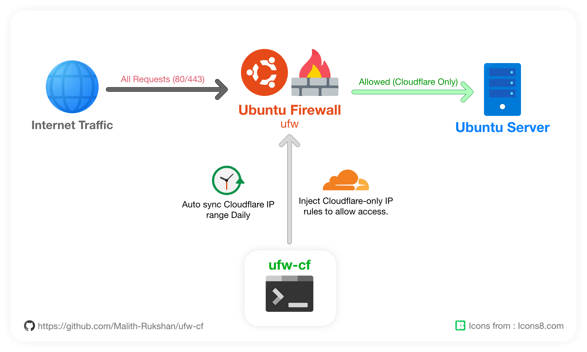

<p align="center">
  
</p>
<h1 align="center">🛡️ ufw-cf</h1>

<div align="center">

[](https://github.com/Malith-Rukshan/ufw-cf/actions/workflows/test.yml)
[](https://github.com/Malith-Rukshan/ufw-cf/releases/latest)
[](LICENSE)

</div>

<h4 align="center">Allow Only Cloudflare to Reach Your Server</h4>

<div align="center">
  Automate Cloudflare IP allow-listing on UFW. Block direct origin access.
  <br/>
  <sup><sub>Simple, secure, Cloudflare-only ツ</sub></sup>
</div>

</br>

**ufw-cf** is an open-source CLI that keeps a Linux server's **UFW firewall** in
sync with **Cloudflare's official IPv4 and IPv6 ranges** — exposing ports
**80/443** to Cloudflare's edge only. Protect your origin server from direct
attacks, bot scanners, and DDoS bypass on Ubuntu, Debian, and Raspberry Pi OS
with one command.

## Why

If a server sits behind Cloudflare (CDN, WAF, DDoS protection, Tunnels), direct
hits to its public IP defeat every protection Cloudflare provides. The fix is
simple: allow inbound traffic on 80/443 **only** from Cloudflare's published
ranges. The lists change from time to time, so the allow-list has to be kept
up to date. That's what `ufw-cf` does.

## Features

- One-shot install, zero runtime deps beyond `ufw`, `curl`, `systemd`
- CLI: `sync`, `status`, `enable`, `disable`, `clean` + interactive menu
- Daily auto-update via a systemd timer with randomised jitter
- Configurable ports (80, 443, or both) and IPv6 toggle
- Rules tagged `# Cloudflare (ufw-cf)` — readable in `ufw status`, safe to clean
- Ships as a `.deb` for Debian/Ubuntu

## Install

### One-liner (recommended)

```bash
curl -sSL https://ufw-cf.sdev.lk/install.sh | sudo bash
```

Or install straight from GitHub:

```bash
curl -sSL https://github.com/Malith-Rukshan/ufw-cf/releases/latest/download/install.sh | sudo bash
```

### From source

```bash
git clone https://github.com/Malith-Rukshan/ufw-cf.git
cd ufw-cf
sudo ./install.sh
```

### First run

> ⚠️ **SSH warning.** If this is your first time enabling UFW on this server,
> make sure SSH is allowed **before** the firewall comes up — otherwise you
> will lock yourself out of the box:
>
> ```bash
> sudo ufw allow 22/tcp        # or your custom SSH port
> sudo ufw enable              # only after SSH is allowed
> ```

```bash
sudo ufw-cf sync       # add Cloudflare rules now
sudo ufw-cf enable     # enable the daily auto-update timer
ufw-cf status          # show what's installed
```

## Commands

| Command          | Action                                                        |
| ---------------- | ------------------------------------------------------------- |
| `ufw-cf`         | Interactive menu.                                             |
| `ufw-cf sync`    | Fetch Cloudflare IPs and update UFW rules.                    |
| `ufw-cf status`  | Show current rules and last update time.                      |
| `ufw-cf enable`  | Enable the auto-update systemd timer.                         |
| `ufw-cf disable` | Disable the auto-update systemd timer.                        |
| `ufw-cf clean`   | Remove every Cloudflare rule added by this tool.              |

## Configuration

Edit `/etc/ufw-cf/config`:

```sh
PORTS="80,443"   # comma-separated: "80", "443", or "80,443"
IPV6=true        # include Cloudflare IPv6 ranges
```

Re-run `sudo ufw-cf sync` to apply.

## Supported systems

- Ubuntu 20.04 / 22.04 / 24.04
- Debian 11 / 12
- Raspberry Pi OS (Bullseye, Bookworm)
- Any Linux with **bash 4+, UFW, curl, and systemd**

## Troubleshooting

<details>
<summary><strong>Rules added but the site is still unreachable from Cloudflare</strong></summary>

Check UFW is active and the default incoming policy is `deny`:
```bash
sudo ufw status verbose
sudo ufw default deny incoming
```
Make sure SSH is allowed before locking yourself out: `sudo ufw allow 22/tcp`.
</details>

<details>
<summary><strong>could not fetch https://www.cloudflare.com/ips-v4</strong></summary>

The server has no outbound HTTPS to Cloudflare. Verify with
`curl -fsSL https://www.cloudflare.com/ips-v4`. Behind a proxy, set
`https_proxy` via a systemd drop-in on `ufw-cf.service`.
</details>

<details>
<summary><strong>ufw-cf.timer shows "not installed"</strong></summary>

The systemd units are missing. Reinstall the `.deb`, or run
`sudo ./install.sh` from the repo.
</details>

<details>
<summary><strong>I changed PORTS and old rules are still there</strong></summary>

Run `sudo ufw-cf sync` again. Every sync wipes the tool's previous rules
before adding the current set.
</details>

<details>
<summary><strong>Removing the package didn't drop the firewall rules</strong></summary>

`apt remove` keeps your config; use `apt purge` to also drop state. To
remove only the live rules at any time: `sudo ufw-cf clean`.
</details>

## How it works

1. `curl` fetches `https://www.cloudflare.com/ips-v4` and `…/ips-v6`.
2. Each line is validated as a CIDR.
3. Existing rules tagged `# Cloudflare (ufw-cf)` are deleted.
4. For every CIDR × every configured port, `ufw allow` is run with the tag.
5. The timestamp and IP list are cached under `/var/lib/ufw-cf/`.

The systemd timer runs once 5 minutes after boot and daily after that,
with up to 30 minutes of randomised delay.

## Development

```bash
make lint     # shellcheck
make test     # bats (mocks ufw/curl)
make deb      # build dist/ufw-cf-<version>-all.deb
```

## License

MIT — see [LICENSE](LICENSE).

## Credits

The original idea of automating UFW allow-rules for Cloudflare belongs to
[**Leow Kah Man**](https://www.leowkahman.com/2016/0502/automate-raspberry-pi-ufw-allow-cloudflare-inbound/),
who described the approach in 2016.

`ufw-cf` was also inspired by
[Paul-Reed/cloudflare-ufw](https://github.com/Paul-Reed/cloudflare-ufw),
which packages a similar idea as plain shell scripts. `ufw-cf` adds a CLI
surface, interactive menu, systemd timer, configurable ports/IPv6, a `.deb`
package, and a one-line installer.

---

Built with ❤️ for the open-source community.
